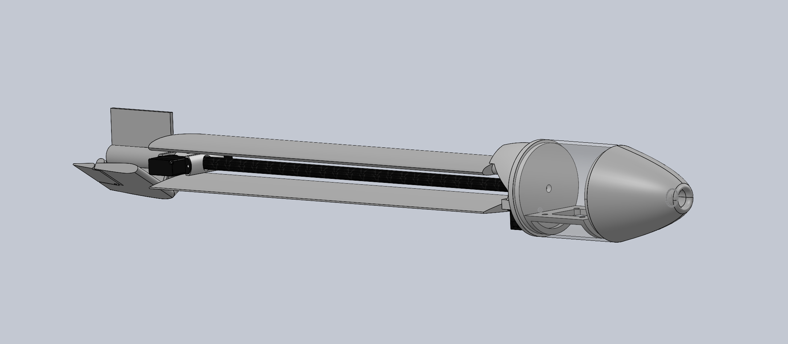
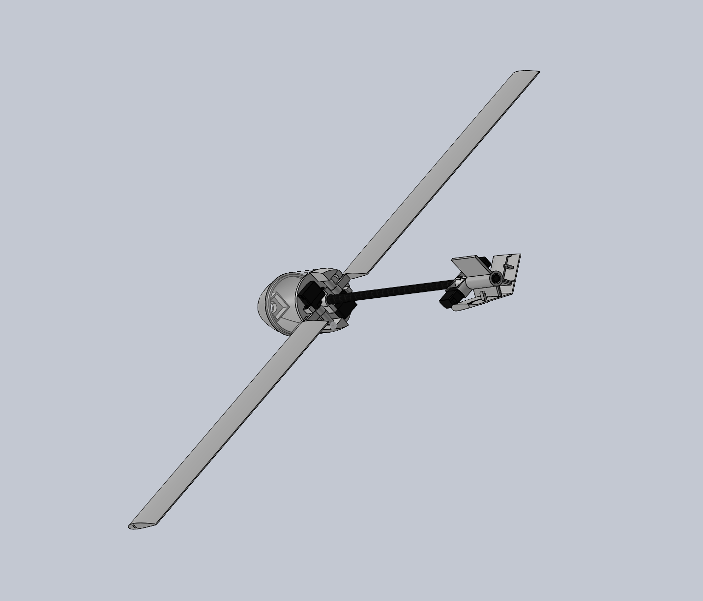
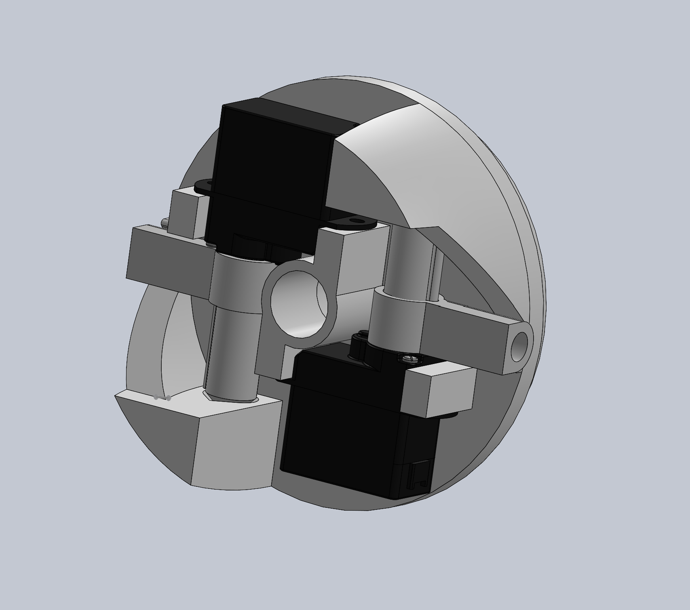
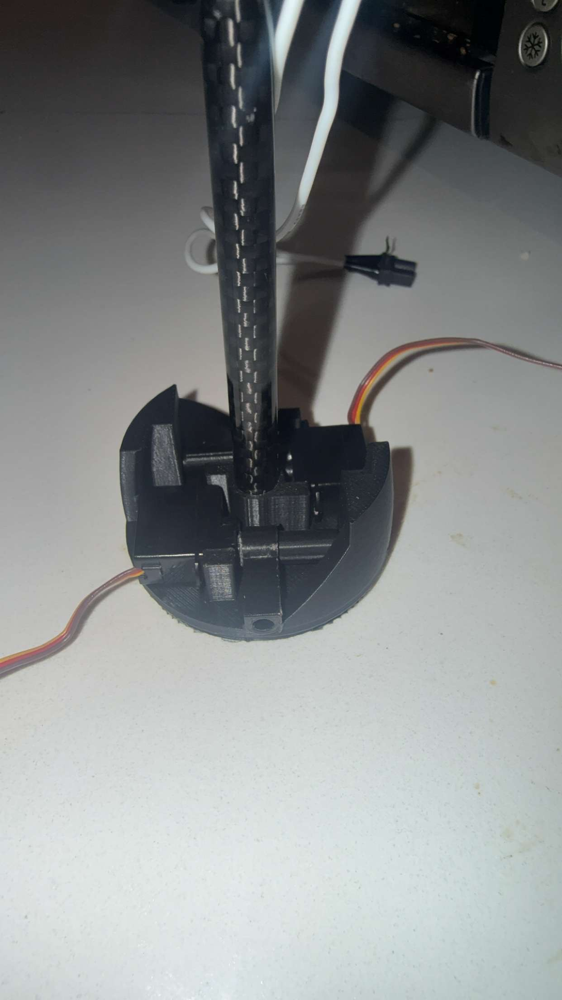
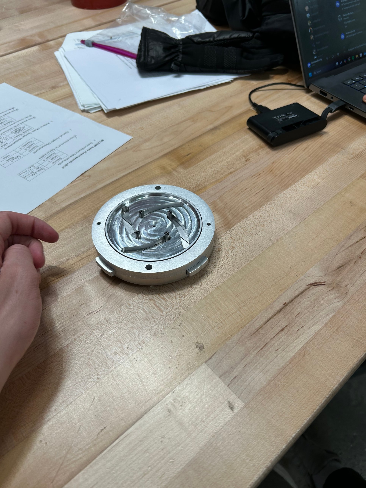
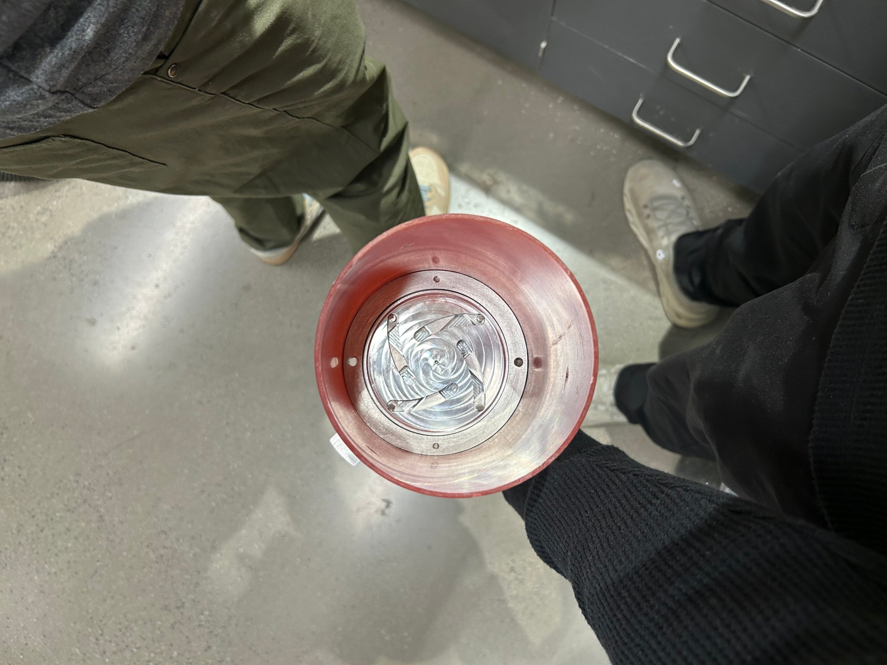
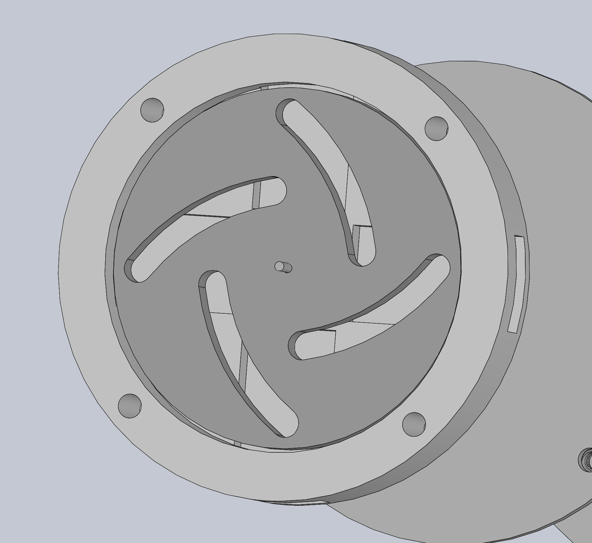
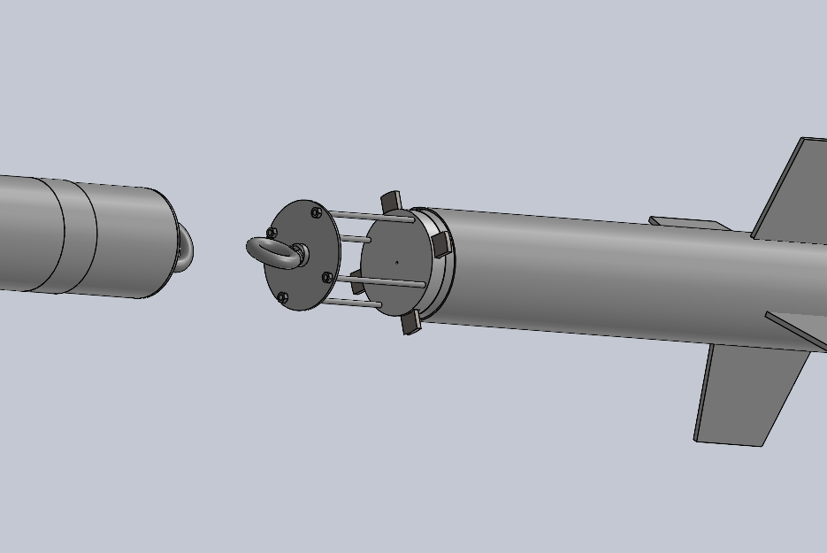
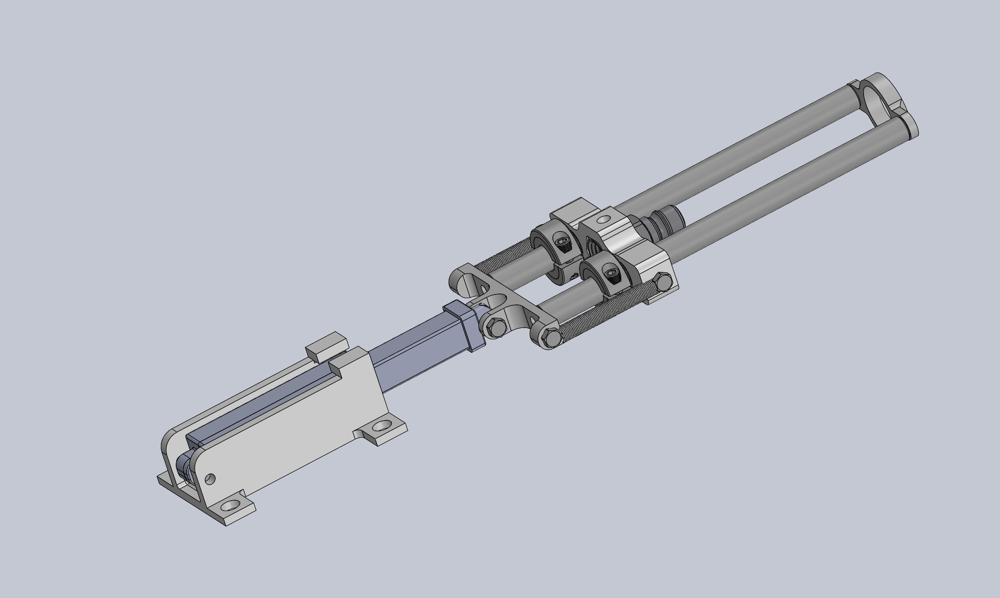

# Henry Perda | Engineering Portfolio

Mechanical Engineering at Northeastern University 

 perda.h@northeastern.edu · [LinkedIn](https://www.linkedin.com/in/henry-perda-3b7b4a379) · [Resume](HENRY_PERDA_SPRING_2027)

---

## Mortar-Launched UAV
**Founder and Lead** · [dates]

A drone that survives a mortar launch (90 m/s in a fraction of a second), deploys spring-loaded wings mid-air, and glides to a precise landing zone. Designed within a 50 mm tube, a $150 per-drone cost, and goals of 1.5 km range, a 1m^2 landing circle, and a 0.5 kg payload. After our PLA frame failed by buckling under real launch loads, I redesigned it in carbon fiber composite, roughly 50x stiffer for a small weight penalty. Also built a custom flight controller.

| | |
|:---:|:---:|
|  |  |
| *CAD with wings stowed for launch* | *CAD with wings deployed* |
|  |  |
| *[Caption: rear hinge mechanism CAD]* | *[Caption: rear hinge assembled]* |

---

## NUaero Airbrakes
**[Role]** · [dates]

Airbrakes module for an L2 rocket that actively controls drag to hit a target apogee of [X ft]. [One sentence on your contribution and result.]

| | |
|:---:|:---:|
|  |  |
| *Machined airbrakes module* | *Module installed in the airframe* |
|  |  |
| *Airbrakes mechanism CAD* | *Airbrakes section overview CAD* |

---

## NUaero Liquid Rocket Engine Quick Disconnect
**[Role]** · [dates]

Quick disconnect for the team's LOX/kerosene engine. [One sentence on your contribution and key challenge.]

| | |
|:---:|:---:|
|  |  |
| *Quick disconnect assembly CAD* | *[Caption: FEA of component]* |

---

## Outreach
**Roxbury Robotics Volunteer** · Afterschool program introducing elementary students to robotics, giving kids with fewer resources access to engineering.

---

**Skills:** [SolidWorks, ANSYS/CFD, composite layup, machining, 3D printing, Python, flight controllers]
